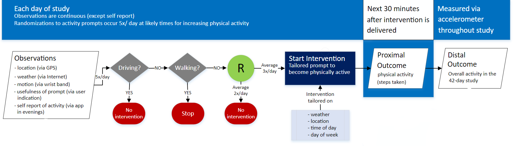

```{r setup, include = FALSE}
# library(reticulate)
# use_python("/usr/bin/python2.7")
knitr::opts_chunk$set(echo = FALSE)
library(knitr)
library(kableExtra)
library(geepack)
library(readr)
library(ggplot2)
library(broom)
library(reshape2)
library(Rcpp)
library(caret)
def.chunk.hook  <- knitr::knit_hooks$get("chunk")
knitr::knit_hooks$set(chunk = function(x, options) {
  x <- def.chunk.hook(x, options)
  paste0("\n \\", "footnotesize","\n\n", x, "\n\n \\normalsize")
})
```

## Methods in Mobile Health (research group)

- Introductions, discuss format and the upcoming week research talks
- Digital Health and Micro-randomized trials (MRTs)
  + Use case: synthetic HeartSteps
- _Primary_ Analysis of MRT data
  + Causal inference
- Debiased Machine Learning and MRTs

# Introductions and Format

## Introductions

- 30-second introductions
  + Name
  + Department
  + Degree
  + Interest level
  + 1 `fun' fact

## Format

- 1.5 hour meeting
  + 45 minutes on the background
  + 45 minutes on the new paper/research 
- Czar of communications: Hanna Venera

## What do I do?

- Plan 4 weeks ahead
  + Next week: Jieru and XXXX
  + Discussing `
- Czar of recruitment: Jieru Shi
- Czar of coordination: Madeline Abbott
- Czar of github management: TBD

## Topic suggestions

- Topic 1: Off-policy evaluation and Markov Decision Processes
- Topic 2: Safe RL and online reinforcement learning
- Topic 2: Debiased ML and Moderation Effects
- Topic 3: MRTs and inference under a joint RL policy (i.e., partial pooling)
- Topic 4: Wearable Sensors and functional data analysis
- Topic 5: High frequency longitudinal data (EMA) and scalable Gaussian Processes
- Topic 6: Data Privacy, MRTs, and CATE

## What do I do now?

- Sign up!
  + Pick a topic that most interests you
  + Find a colleague with similar interest (or ask us)
  + Email HMJ and me to set up a meeting (Jieru coordinates, Madeline to attend)
  + We will decide on the `tutorial' and `research' content
  + Meet week before with me and Madeline to go over presentation
- Propose new topics and `recruit a colleague'

# Mobile health and micro-randomized trials

## Mobile Health Interventions

- Pull intervention
  + Static content that can be accessed _whenever the user finds it necessary_
  + E.g., Mindfulness or guided meditation, exercise tips, low salt food alternative lookup
- Push intervention
  + App component that is _triggered by the system itself_
  + No need for user involvement
  + E.g., prompt to encourage self-monitoring, prompt to encourage physical activity, prompt to use the low salt alternative component.
  
  
## HeartSteps (PI Klasnja)

- Develop a mobile activity coach for individuals who are at risk of coronoary artery disease
- Include right combination of pull components with
- Push components _delivered at the right times_ to encourage activity throughout the day

## HeartSteps V1: Evening Planning

```{r eventplanning, echo=FALSE, fig.cap="Event Planning Example", out.width = '30%'}

```

## HeartSteps V1: Activity Suggestion

```{r activitysuggestion, echo=FALSE, fig.cap="Activity Suggestion Example", out.width = '30%'}
knitr::include_graphics("figs/activity_suggestion.png")
```

## Questions to improve the activity suggestions

- Do tailored activity suggestions have an effect at all?
- Does the effect of suggestions change over time? 
- When should we send suggestions for optimal effect?

## HeartSteps 

* Three iterative studies
  + 42 day micro-randomized study 
    - Sedentary individuals
  + 90 day + 270 micro-randomized study 
    - Personalized randomization scheme
    - People with Stage 1 hypertension
* Synthetic HeartSteps
  + Build from the 90 day MRT study.
  + Randomizations set similar to MRT for illustrative purposes.

## Micro-randomized trial

- Micro-randomization = each user is randomized many times = sequential experimentation
- Randomization may use online predictions as well as reinforcement learning
- Probabilistic budgets on number of treatment pushes to manage treatment burden

## Data from wearable devices

- On each individual we observe the sequence
$$
(O_1, A_1, Y_2, O_2, A_2, Y_3, \ldots, O_t, A_t, Y_{t+1}, \ldots, O_T, A_T, Y_{T+1})
$$
- $t$: Decision point
- $O_t$: Observations at $t^{\text{th}}$ decision point
- $A_t$: treatment push at $t^{\text{th}}$ decision point
- $Y_{t+1}$: Proximal outcome (e.g., reward, utility, cost)

## Micro-randomized trial elements:

* Decision points, $t$ (Times at which an intervention can be provided)
  + Regular intervals in time (e.g., every 10 minutes)
  + At user demand
* **HeartSteps**: Approximately every 2-2.5 hours at user-specific times labeled as monring, mid-day, mid-afternoon, early evening, after dinner

## Micro-randomized trial elements:{.columns-2}

\begin{columns}
\begin{column}{0.48\textwidth}

\begin{itemize}
\item Treatments $A_t$:
\item Types of treatments that can be provided at a decision point, $t$
\item {\bf HeartSteps}: tailored activity suggestion (yes/no)

\end{itemize}

\end{column}
\begin{column}{0.48\textwidth}
```{r activityfig, echo=FALSE, fig.cap="Activity Suggestion Example", out.width = '75%'}
knitr::include_graphics("figs/act_suggestion_small.PNG")
```
\end{column}
\end{columns}


## Micro-randomized trial elements

* Randomization:
  + A stochastic strategy for selecting among the treatments at each decision point
  + The probabilistic distribution of $A_t$
* **HeartSteps**: push or do not push tailed suggestion
  + $P(A_t = 1) = 0.6$ (push)
  + $P(A_t = 0) = 0.4$ (do not push)
* Alternatives:
  + Use predictions in combination with an online algorithm to uniformly spread recommendations across *risk times* throughout a day 
  + Use reinforcement learning to personalize the treatment recommendations

## Micro-randomized trial elements:

5. Proximal outcome: $Y_{t+1}$
  + Mediators that are thought to be critical to achieving a longer term clinical health outcome such as improved heart health
- __HeartSteps__: Activity (step count) over next 30 minutes
- Question: how can we use AI to determine the length of time over which the proximal outcome is measured?

## Availability

* Interventions, $A_t$, can only be delivered at a decision point if the decision point is _available_ for the user
  + $O_t$ includes $I_t = 1$ if available, and $I_t = 0$ if not
* Availability is known pre-decision point, i.e., pre-treatment
* Availability is not adherence, nor is it the same as interruptibility, receptivity

## Why Micro-randomization?

* Randomization (+ representative sample) is a gold standard in providing data to assess causal effects

* Sequential randomizations will enhance replicability of data analyses (decision rule development)


## Experimentation for continuous improvement

- "Iterative nature of experimentation" (RA Fisher & George Box)
- " At Google, experimentation is practically a mantra; we evaluate almost every change that potentially affects what our users experience." (4 Google scientists)
- "Online experiments are widely used to compare specific design alternatives, but they can also be used to produce generalizable knowledge and inform strategic decision making. Doing so often requires sophisticated experimental designs, iterative refinement, and careful logging and analysis" (3 Facebook scientists)

## Synthetic HeartSteps Data

- An MRT simulator based on Heartsteps V2 has been built in R and is available [here](https://github.com/wdempsey/AI4Health-Online-Experimentation)
- This talk and the batch synthetic data are available [here](https://drive.google.com/drive/folders/1rhCWugawTjEnwmagrOPwxNssrgIsnypT?usp=sharing)

- _ID_: Numeric id taking values between 1-40
- _Day_: Day-in-study (numeric)
- _Decision time_: Numeric indicator of indicator of decision time per day (1-5)
- _Dosage/burden_: Pre-defined function of past pushes (walking + anti-sedentary messages)
- _Engagement Indicator_: Binary indicator of whether the number of screens encountered in app from prior day from 12am to 11:59pm is greater than the 40% quantile of the screens collected.

## Synthetic HeartSteps Data

- _Temperature_: Temperature (In Celsius degree) at the current location
- _Location_: 1 if at a location other than home or work; 0 if at home or work (pre-specified)
- _Variation Indicator_: Indicator of higher recent variation in step counts than median long-term variation
- _Pre-treatment Steps_: Log-transformed steps 30 mins prior to the current decision time from the tracker; $\log(y+0.5)$.
- _Square root of steps yesterday_: The square root of step counts from the tracker collected from 12am to 11:59 pm

## Synthetic HeartSteps Data

```{r, echo = F}
HS_MRT_data = read.csv("data/HS_MRT_example_v2.csv")
knitr::kable(head(HS_MRT_data[1:5, 1:6]), format="simple",
             digits = rep(2,6), booktabs=TRUE)
```

## Synthetic HeartSteps Data

```{r, echo = F}
knitr::kable(head(HS_MRT_data[1:5, c(3,7:11)]), format="simple",
             digits = rep(2,6), booktabs=TRUE)
```

## Synthetic HeartSteps Data

```{r, echo = F}
knitr::kable(head(HS_MRT_data[1:5, c(3, 12:15)]), format="simple",
             digits = rep(2,6), booktabs=TRUE)
```

# Causal excursions and primary analysis methods

## Primary Analysis of MRT Data:

* Why consider conducting simple, interpretable, primary analyses?
  + In clinical and commercial settings
* Understand why causal excursion effects are useful for continual learning

## Questions to Improve Synthetic HeartSteps Activity Suggestions

* Do tailored activity suggestions ahve an effect at all?
* Do less and more burdensome activity suggestions work equally well?
* Does the effect of suggestions change of time?
* When should we send suggestions for optimal effect?

## Micro-randomized trial

* How to justify the experimtntal trial costs in clinical research setting
  + Address a question that can be stated across disciplinary boundaries and be able to provide guarantees
  + Design trial so that a variety of further interesting questions can be answered
* **Large number of stakeholders with differing data needs/interests**

## Conceptual model: Primary analysis

* Data analysts want to fit a series of increasingly complex models:
* **Primary analysis**
$$
Y_{t+1} `\sim' \underbrace{\alpha_0 + \alpha_1^\top Z_t}_{\text{reduce noise}} + \underbrace{\beta_0 A_t}_{\text{causal main effect}}
$$
* $Z_t$: summary formed from $t$ and past/present observations
  + `Control Variables'
* $\beta_0$: is the effect, marginal over all observed and unobserved variables, of the activity suggestion on subsequent activity

## Conceptual model: Secondary analysis

* **Secondary analysis**
$$
Y_{t+1} `\sim' \underbrace{\alpha_0 + \alpha_1^\top Z_t}_{\text{reduce noise}} + \underbrace{\beta_0 A_t + \beta_1 A_t S_t}_{\text{causal moderation effect}}
$$
* $Z_t$: control variables
* $S_t$: potential moderator (e.g., current level of engagement)
* $\beta_0 + \beta_1$: is the effect when an individual is engaged ($S_t = 1$), marginal over all observed and unobserved variables, of the activity suggestion on subsequent activity.

## Scientific goal

* Analytic methods that are consistent with the scientific understanding of the meaning of $\beta$ coefficients
  + Make the scientist developing the intervention behavioral scientist
* Analytic methods that require minimal additional assumptions
  + Don't require strong modeling assumptions that may not hold
* Causal inference challenges:
  + Time-varying treatment $(A_t, t=1,\ldots,T)$
  + `Independent' variables: $Z_t, S_t, I_t$ all may be affected by prior treatment
* Robustly facilitate noise reduction via use of controls,~$Z_t$.

## Causal effects

* Use potential outcomes to define the effect
* The effects we define are *causal excursions*
  + Contrasts at a given time, averaging over prior randomizations
  + A 1-step excursion (send suggestion vs don't send suggestion) from the underlying stochastic policy.

## Potential outcomes

* $\bar A_t = (\bar A_1, \bar A_2,\ldots, \bar A_t)$
  + $\bar a_t$: realizations of treatments
* $Y_{t+1} (\bar a_{t-1})$ is the potential proximal outcome
* $I_{t+1} (\bar a_{t-1})$ is the potential *available for treatment* indicator
* $H_{t} (\bar a_{t-1})$ is the potential history vector
  + $S_t (\bar a_{t-1})$ is a vector of features from the potential history.

## Fundamental problem of causal inference

* Individual level causal effect (binary $A_t$):

$$
Y_{t+1} (\textcolor{blue}{\bar A_{t-1}}, \textcolor{red}{1}) -
Y_{t+1} (\textcolor{blue}{\bar A_{t-1}}, \textcolor{red}{0})
$$

* \textcolor{blue}{Averaging over underlying stochastic policy}
* \textcolor{red}{Excursion contrast of treat $A_t =1$ vs don't treat $A_t = 0$}
* Fundamental problem:
  + Data alone cannot be used to predict or estimate the effect

## Solution to the fundamental problem of causal inference

* Instead of estimating/predicting individual level causal effects,
$$
Y_{t+1} (\bar A_{t-1}, 1) - Y_{t+1} (\bar A_{t-1}, 0)
$$
estimate expectations or conditional expectations of these effects:
$$
E\left[ Y_{t+1} (\bar A_{t-1}, 1) - Y_{t+1} (\bar A_{t-1}, 0) \right]
$$
* See [here](https://cdn1.sph.harvard.edu/wp-content/uploads/sites/1268/2020/11/ciwhatif_hernanrobins_23nov20.pdf) for a great resource on causal inference (especially observational studies)

## Marginal & Causal effects

* The **excursion effect** at decision point $t$:
$$
E\left[ Y_{t+1} (\bar A_{t-1}, 1) - Y_{t+1} (\bar A_{t-1}, 0) \mid I_t (\bar A_{t-1}) = 1, 
\textcolor{blue}{S_t (\bar A_{t-1})} \right]
$$

* Effect is conditional on availability; only concerns the subpopulation of users available at decision time $t$

* \textcolor{blue}{Effect is marginal over any $Y_s, s \leq t$ and $A_s, s < t$ not in $S_{t} (\bar A_{t-1})$}

## Switching from potential outcomes to observables:

The **excursion effect** can be expressed in terms of conditional expectations on *observable data* (under some assumptions):
$$
E\left[ E[ Y_{t+1} | H_t, A_t = 1] - E[ Y_{t+1} \mid H_t, A_t = 0] \mid I_t = 1, 
S_t \right] = \textcolor{blue}{S_t^\top \beta}
$$

* $H_t$: observation history up to time $t$ (excluding treatment)
* $S_t$ is a vector of data summaries and time $t$
* $I_t$ indicator of availability
* \textcolor{blue}{Treatment effect model}: we aim to conduct inference about $\beta$

## An analysis method: Weighted and centered least squares estimation

* Simple, interpretable, method for complex data
* Enables unbiased inference for a causal, overall, treatment effect (the $\beta$'s)
* Inference for treatment effect is not biased by how we use controls, $Z_t$, to reduce the noise variance in $Y_{t+1}$

## Steps in estimation

* Estimate probabilities: $\tilde p_t (s) \in (0,1)$
* Form weights
$$
W_t = \left( \frac{\tilde p_t (S_t)}{p_t (H_t)} \right)^{A_t}
\left( \frac{1-\tilde p_t (S_t)}{1-p_t (H_t)} \right)^{1-A_t}
$$
* Center treatments: $A_t \to A_t - \tilde p_t (S_t)$
* Minimize
$$
E_n \left[ \sum_{t=1}^T \left( Y_{t+1} - Z_t^\top \alpha - (A_t - \tilde p_t (S_t)) S_t^\top \beta \right)^2 I_t W_t \right]
$$
where $E_n$ is the empirical distribution over individuals.

## Key points

* We **do not** need to assume
$$
E[ Y_{t+1} | A_t, I_t = 1, Z_t] = Z_t^\top \alpha + (A_t - \tilde p_t (S_t)) S_t^\top \beta
$$
* This would assume the conditional mean of $Y_{t+1}$ is correctly specified which is a much stronger assumption!
* We only assume the **treatment effect** is correctly specified
$$
E\left[ E[ Y_{t+1} | H_t, A_t = 1] - E[ Y_{t+1} \mid H_t, A_t = 0] \mid I_t = 1, 
S_t \right] = \textcolor{blue}{S_t^\top \beta}
$$
* Then under moment conditions, $\hat \beta \to \beta_0$ 
  
## Gains from randomization

* Causal inference for a marginal treatment effect
* Inference on treatment effect is robust to working model:
$$
E[ Y_{t+1}  | I_t = 1, H_t ] \approx Z_t^\top \alpha
$$

* $Z_t \subseteq H_t$
* Contrast to literature on partially linear, single index models and varying coefficient models

## Choice of weights

* Choice of $\tilde p_t (S_t)$ determines the marginalization over time under model misspecification of treatment effect

* Example: $S_t = 1$, $\tilde p_t (S_t) = \tilde p$. Then $\hat \beta$ is an estimator of

$$
\frac{\sum_{t=1}^T E[ I_t ] \beta_t }{\sum_{t=1}^T E[ I_t ]}
$$
where $\beta(t)$ is the causal excursion effect at decision point $t$

# Synthetic HS case study

## HeartSteps Schema

```{r hs_traj, echo=FALSE, fig.cap="HS Schema", out.width = '100%'}

```

## Synthetic HeartSteps

One each of the $n=40$ participants:

* Activity suggestion, $A_t$:
  + Provide a tailored activity suggestion with probability 0.5
  + Do nothing (probability $0.5$)
* $5$ times per day $\cdot 90$ days = $450$

## Synthetic HeartSteps: Center actions

```{r warning=FALSE, echo = TRUE}
HS_MRT_data$MRT_action_c = HS_MRT_data$MRT_action - 
  HS_MRT_data$MRT_probs
```

## Synthetic Heartsteps: 

```{r warning=FALSE, echo = FALSE, cache = TRUE}
# For model 3: add dosage as a 3rd moderator in our method.
fit_wcls = geeglm(MRT_reward ~ MRT_action_c*day,
                 data = HS_MRT_data,
                 weights = MRT_avails, 
                 id =id, 
                 scale.fix = T) 

knitr::kable(tidy(fit_wcls), 
             digits = c(2,2,4,2,3))
```

## Synthetic Heartsteps: 

```{r warning=FALSE, echo = FALSE, cache = TRUE}
# For model 3: add dosage as a 3rd moderator in our method.
fit_cwcls = geeglm(MRT_reward ~ MRT_action_c*(day + logpresteps + engagement + dosage),
                 data = HS_MRT_data,
                 weights = MRT_avails, 
                 id =id , 
                 scale.fix = T) 
knitr::kable(tidy(fit_cwcls), 
             digits = c(2,2,4,2,3))
```

## Synthetic HeartSteps:

```{r, echo = FALSE}

plot_moderator = function(fit_wcls, fit_cwcls, moderator= "day"){
  var_wcls = matrix(0, nrow = 2, ncol = 2)
  coeff_wcls = coef(fit_wcls)[c("MRT_action_c",paste0("MRT_action_c:", moderator))]
  
  vcov_m = vcov(fit_wcls)
  
  var_wcls[1,1] = vcov_m["MRT_action_c","MRT_action_c"]
  var_wcls[1,2] = vcov_m["MRT_action_c",paste0("MRT_action_c:", moderator)]
  var_wcls[2,1] = var_wcls[1,2]
  var_wcls[2,2] = vcov_m[paste0("MRT_action_c:", moderator),paste0("MRT_action_c:", moderator)]
  
  var_cwcls = matrix(0, nrow = 2, ncol = 2)
  coeff_cwcls = coef(fit_cwcls)[c("MRT_action_c",paste0("MRT_action_c:", moderator))]
  
  vcov_m = vcov(fit_cwcls)
  
  var_cwcls[1,1] = vcov_m["MRT_action_c","MRT_action_c"]
  var_cwcls[1,2] = vcov_m["MRT_action_c",paste0("MRT_action_c:", moderator)]
  var_cwcls[2,1] = var_cwcls[1,2]
  var_cwcls[2,2] = vcov_m[paste0("MRT_action_c:", moderator),paste0("MRT_action_c:", moderator)]
  
  
  
  data = as.data.frame(matrix(NA, nrow = 200, ncol = 5))
  colnames(data) = c("x","y","lower","upper","Method")
  data$x = rep(1:100,2)
  data$Method = rep(c("Centering-WCLS","WCLS"),each = 100)
  
  data$y[1:100] = coeff_cwcls[1]+ coeff_cwcls[2] *data$x[1:100] 
  data$y[101:200] = coeff_wcls[1]+ coeff_wcls[2]*data$x[101:200]
  
  
  
  ########## part 1
  var_cor_cwcls = var_cwcls
  
  calculate_se = function(x) sqrt(t(c(1,x))%*%var_cor_cwcls%*%c(1,x))
  
  se_cor = sapply(data$x[1:100],FUN=calculate_se)
  
  t_quantile <- qt(0.975, 40-length(fit_cwcls[["coefficients"]]))
  
  data$lower[1:100] = data$y[1:100] - t_quantile*se_cor
  data$upper[1:100] = data$y[1:100] + t_quantile*se_cor
  
  
  ####### part2
  
  var_cor_wcls = var_wcls
  
  calculate_se = function(x) sqrt(t(c(1,x))%*%var_cor_wcls%*%c(1,x))
  
  se_cor = sapply(data$x[101:200],FUN=calculate_se)
  
  
  t_quantile <- qt(0.975, 40-length(fit_wcls[["coefficients"]]))
  
  data$lower[101:200] = data$y[101:200] - t_quantile*se_cor
  data$upper[101:200] = data$y[101:200] + t_quantile*se_cor
  
  
  
  p<-ggplot(data=data, aes(x=x, y=y, colour=Method)) + 
    geom_line()+
    geom_ribbon(aes(ymin=lower, ymax=upper), linetype=2, alpha=0.1)+
    xlab(moderator)+
    ylab("MRT Reward change")+
    theme_bw()+
    theme(axis.line = element_line(colour = "black"),
          panel.grid.major = element_blank(),
          panel.grid.minor = element_blank(),
          panel.border = element_blank(),
          panel.background = element_blank()) +
    geom_hline(yintercept =0, linetype=2)+
    theme(axis.text=element_text(size=12),
          axis.title=element_text(size=14))
  p
  
}

plot_moderator(fit_wcls, fit_cwcls, moderator= "day")
```

## Synthetic Heartsteps: 

```{r warning=FALSE, echo = FALSE, cache = TRUE}
# For model 3: add dosage as a 3rd moderator in our method.
fit_wcls_mod = geeglm(MRT_reward ~ MRT_action_c*(day + logpresteps + engagement + dosage + other.location),
                 data = HS_MRT_data,
                 weights = MRT_avails, 
                 id =id , 
                 scale.fix = T) 
knitr::kable(tidy(fit_wcls_mod), 
             digits = c(2,2,4,2,3))
```

## Initial conclusions

* The data indicates a causal effect of activity suggestions on step count in the succeeding 30 minutes 
  + The effect is positive for the first 20 days and then becomes negative
  + Steps in prior 30 minutes negatively impacts the effect of the suggestion
  + Engagement strongly positively impacts the effect of the suggestion
  + Being at home/work has a strong positive impact on the effect of the suggestion
  + Dosage does not have a strong effect
* Updating the stochastic policy to depend on prior steps, engagement, and other location may improve proximal outcomes further

# Next Steps for intervention development

## Next Steps for intervention development

* We have answered the following questions
  + Is the intervention effective, on average?  Does the average effectiveness vary over time in study?
  + Does the effectiveness interact with time-varying contexts?
* Next question

\begin{center}
\textcolor{red}{How do we use this knowledge to improve the intervention?}
\end{center}

* Use the analysis result to form a **warm-start policy** for online reinforcement-learning algorithm
* Include the identified contexts as state information in the RL algorithm

## Warm-Start Policy + Bandit Algorithms

* A simple idea: use global fit to form data-informed prior for action selection strategy within a Thompson sampling algorithm
* Model mean *reward* (proximal outcome) $E[R_{t+1} | S_t = s, A_ t =a] = r(s,a)$
  + Observe context features, $s$
  + Action selection strategy selects treatment, $a$
  + Observe reward,~$R$
  + *Learning algorithm updates parameters in mean/distribution of reward
  + Repeat!
  
## Linear, ``Thompson Smapling'' Bandit

* Gaussian linear model with mean reward
$$
E[ R_{t+1} | S_t = s, A_t = a] = r(s,a) = \eta^\top f(s,a)
$$
* Initial $\eta$ parameters in mean reward with a prior distribution (*warm-start!*)
* Update posterior distribution of $\eta$ given $(S_t, A_t, R_{t+1})$
  + In this simple case, posterior is Gaussian
* Select next treatment $a$ with probability equal to posterior probability that treatment $a$ has highest mean reward.

## Synthetic HeartSteps V2

```{r hs_trajv2, echo=FALSE, fig.cap="HS Randomization Schema", out.width = '100%'}
knitr::include_graphics("figs/HeartSteps_Trajectory_V2.png")
```

## Warm-Start Policy

```{r warning=FALSE, echo = FALSE, cache = TRUE}
# For model 3: add dosage as a 3rd moderator in our method.
fit_lm = lm(MRT_reward ~ MRT_action_c*(day + logpresteps + engagement + other.location),
                 data = HS_MRT_data, weights = MRT_avails) 
knitr::kable(tidy(fit_lm), 
             digits = c(2,2,4,2,3))
```

## Assessing individual-level heterogeneity in effects

```{r warning=FALSE, echo = FALSE, cache = TRUE}
unique_ids = unique(HS_MRT_data$id)
individual_coefs = matrix(nrow = length(unique_ids), ncol = 10)
for (i in 1:length(unique_ids)) {
  current_id = unique_ids[i]
  fit_lm = lm(MRT_reward ~ MRT_action_c*(day + logpresteps + engagement + other.location),
              data = subset(HS_MRT_data, id == current_id), weights = MRT_avails) 
  individual_coefs[i,] = fit_lm$coefficients
}
individual_coefs = data.frame(individual_coefs[,c(2,7,8,9,10)])
names(individual_coefs) = c("A_t", "A_t:day", "A_t:Step", "A_t:Engage", "A_t:Location")
data_mod <- melt(individual_coefs, measure.vars=c("A_t", "A_t:day", "A_t:Step", "A_t:Engage", "A_t:Location"))
ggplot(data = data_mod, aes(x=variable, y=value)) + geom_boxplot(aes(fill=variable)) + theme(legend.position="none", axis.title.x = element_blank())
```

## Summary

* Conceptual model (domain science)

* \textcolor{blue}{Micro-randomized trial}

* \textcolor{blue}{Causal excursion effect and exploratory data analysis}

* Improved treatment policy

* Confirmatory Trial

# Debiased Machine Learning

## Debiased Machine Learning: Basics

* Use Neyman orthogonal scores for likelihood and other M-estimation problems
* If score function $\phi$ did not satisfy 
* High-dimensional linear regression

\begin{aligned}
Y &= D \theta_0+ X'\beta_0 + U, \quad E_P [ U(X', D)' ] = 0, \\
D &= X' \gamma_0 + V, \quad E_P[ V X] = 0
\end{aligned}

## Neyman othrogonal score

$$

$$

## DML for ATE

1. Divide up the data into $Q$ evenly sized folds
2. [R-learner] Fit $\hat m = E[Y | X]$ and $\hat e = E[A | X] $ with cross-fitting over the Q folds tuned for optimal predictive accuracy
2. [DR-learner] Fit $\hat m_a = E[ Y | X, A=a]$ and $\hat e = E[A | X]$

## DML + MRT

```{r, cache = TRUE}
flds <- createFolds(unique(HS_MRT_data$id), k = 5, list = TRUE, returnTrain = FALSE)
final_MRT_data = rep(0,0)

for(folds in 1:5) {
  train.set = HS_MRT_data[!is.element(HS_MRT_data$id,flds[[folds]]),]
  test.set = HS_MRT_data[is.element(HS_MRT_data$id,flds[[folds]]),]
  
  HS_MRT_train = train(MRT_reward ~ .,
                       data = train.set, 
                       method = "gbm", 
                       trControl = trainControl(method = "cv"))
  
  test.set$MRT_action = 1
  g.pred.action1 = predict(HS_MRT_train$finalModel, test.set)
  test.set$MRT_action = 0
  g.pred.action0 = predict(HS_MRT_train$finalModel, test.set)
  est_controls = 0.5*(g.pred.action1+g.pred.action0)
  

  test.set = HS_MRT_data[is.element(HS_MRT_data$id,flds[[folds]]),]
  test.set$MRT_reward_minus_controls = test.set$MRT_reward - est_controls
  final_MRT_data = rbind(final_MRT_data, test.set)
  
}
```

## DML + MRT

```{r, cache = TRUE}
fit_dml = geeglm(MRT_reward_minus_controls ~ MRT_action*day, 
                 data = final_MRT_data, weights = MRT_avails, id = id)
knitr::kable(summary(fit_dml)$coefficients, format="simple", booktabs=TRUE)

fit_std = geeglm(MRT_reward ~ MRT_action_c*day + logpresteps + engagement + other.location,
                 data = HS_MRT_data, weights = MRT_avails, id = id) 
knitr::kable(summary(fit_std)$coefficients, format="simple", booktabs=TRUE)
```

## Additional resources

* Centered and weighted least squares [Boruvka et al., 2018]
* Delayed effect [Boruvka et al. 2018, Qian et al., 2020]
* Stratified MRT [Dempsey et al. 2020]
* Excursion effect with binary outcome [Qian et al., 2020]
* [Sample size calculator (continuous)](https://statisticalreinforcementlearninglab.shinyapps.io/mrt_ss_continuous/)
* [Sample size calculator (binary)](https://tqian.shinyapps.io/mrt_ss_binary/)
* Excursion effect with cluster-level heterogeneity [Dempsey et al. 2021]
* Increasing efficiency of causal excursion effect estimation via orthogonalization  [Dempsey et al. 2022]

