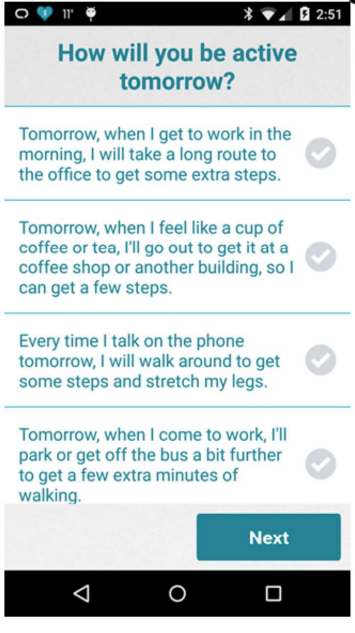

```{r setup, include = FALSE}
library(reticulate)
use_python("/usr/bin/python2.7")
knitr::opts_chunk$set(echo = FALSE)
library(knitr)
library(kableExtra)
```

## AI 4 Mobile Health

- Digital Health and Micro-randomized trials (MRTs)
  + Use case: synthetic HeartSteps
- _Primary_ Analysis of MRT data
  + Causal inference
- MRTs with personalization
  + Reinforcement learning

## Mobile Health Interventions

- Pull intervention
  + Static content that can be accessed _whenever the user finds it necessary_
  + E.g., Mindfulness or guided meditation, exercise tips, low salt food alternative lookup
- Push intervention
  + App component that is _triggered by the system itself_
  + No need for user involvement
  + E.g., prompt to encourage self-monitoring, prompt to encorage physical activity, prompt to use the low salt alternative component.
  
## HeartSteps (PI Klasnja)

- Develop a mobile activity coach for individuals who are at risk of coronoary artery disease
- Include right combination of pull components with
- Push components _delivered at the right times_ to encourage activity throughout the day

## HeartSteps V1: Evening Planning

```{r eventplanning, echo=FALSE, fig.cap="Event Planning Example", out.width = '30%'}

```

## HeartSteps V1: Activity Suggestion

```{r activitysuggestion, echo=FALSE, fig.cap="Activity Suggestion Example", out.width = '30%'}

```

## Questions to improve the activity suggestions

- Do tailored activity suggestions have an effect at all?
- Does the effect of suggestions change over time? 
- When should we send suggestions for optimal effect?

## HeartSteps 

- 3 iterative studies

## Micro-randomized trial

- Micro-randomization = each user is randomized many times = sequential experimentation
- Randomization may use online predictions as well as reinforcement learning
- Probabilistic budgets on number of treatment pushes to manage treatment burden


## Part 1b: Investigating mHealth randomized trial data

- An MRT simulator based on Heartsteps V2 has been built in R and is available [here](https://drive.google.com/drive/folders/1rhCWugawTjEnwmagrOPwxNssrgIsnypT?usp=sharing)
- _ID_: Numeric id taking values between 1-110
- _Day_: Day-in-study (numeric)
- _Decision time_: Numeric indicator of indicator of decision time per day (1-5)
- _Dosage/burden_: Pre-defined function of past pushes (walking + anti-sedentary messages)
- _Engagement Indicator_: Binary indicator of whether the number of screens encountered in app from prior day from 12am to 11:59pm is greater than the 40% quantile of the screens collected.

## Investigating mHealth randomized trial data

- _Temperature_: Temperature (In Celsius degree) at the current location
- _Location_: 1 if at a location other than home or work; 0 if at home or work (pre-specified)
- _Variation Indicator_: Indicator of higher recent variation in step counts than median long-term variation
- _Pre-treatment Steps_: Log-transformed steps 30 mins prior to the current decision time from the tracker; $\log(y+0.5)$.
- _Square root of steps yesterday_: The square root of step counts from the tracker collected from 12am to 11:59 pm 

## Synthetic HeartSteps Data

```{r, echo = TRUE}
HS_MRT_data = read.csv("data/HS_MRT_example.csv")
knitr::kable(head(HS_MRT_data[1:5, 1:6]), format="simple",
             digits = rep(2,6), booktabs=TRUE)
```

## Synthetic HeartSteps Data

```{r, echo = TRUE}
HS_MRT_data = read.csv("data/HS_MRT_example.csv")
knitr::kable(head(HS_MRT_data[1:5, c(3,7:10)]), format="simple",
             digits = rep(2,6), booktabs=TRUE)
```

## Synthetic HeartSteps Data

```{r, echo = TRUE}
HS_MRT_data = read.csv("data/HS_MRT_example.csv")
knitr::kable(head(HS_MRT_data[1:5, c(3, 11:14)]), format="simple",
             digits = rep(2,6), booktabs=TRUE)
```

